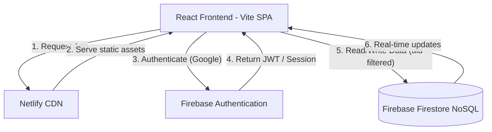
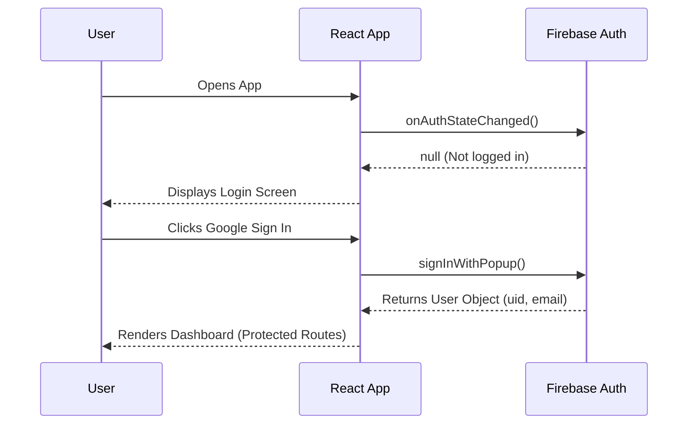

# PROJECT ARCHITECTURE AND DECISIONS


## 1. Project Overview

### What is Rently?
Rently is a web-based dashboard designed to help property owners and landlords track rental income, manage expenses, and maintain a directory of tenants. 

### What problem does it solve?
Managing multiple properties often involves scattered spreadsheets, disconnected messaging apps, and manual tracking of rent collections. This project centralizes financial tracking (income vs. expenses) and tenant communication (e.g., WhatsApp rent reminders) into a single, intuitive interface.

### Who are its target users?
*   Landlords
*   Property Managers
*   Real Estate Investors

### Core features currently implemented
*   **Google Authentication:** Secure login using Firebase Auth.
*   **Role-Based Access:** Dedicated interfaces for Landlords and Tenants during onboarding.
*   **Property Management:** Add and manage properties, and generate smart join codes for tenants.
*   **Financial Dashboard:** Real-time overview of monthly balances, income, and expenses with interactive charts.
*   **Transaction Logging:** Add, view, and delete income and expense records.
*   **Tenant Directory:** Automatically aggregates tenant information based on transaction history.
*   **WhatsApp Integration:** Quick-action buttons to send pre-formatted rent reminders to tenants via WhatsApp.
*   **Monthly Reports:** Aggregated historical data of income and expenses sorted by month.

### Future scope and planned enhancements
*   Automated rent due notifications.
*   Payment history portal for tenants.
*   PDF export for monthly reports.

---

## 2. System Architecture

### High-level architecture explanation
The application follows a standard Serverless Single-Page Application (SPA) architecture. The frontend is built with React and Vite. It directly communicates with Firebase services (Authentication and Firestore) using the Firebase Client SDK. Netlify handles the hosting and CI/CD pipeline.

### Diagram: Architecture Flow



---

## 3. Technology Stack

### React (v19.x)
*   **Why it was chosen:** Component-based architecture allows for highly reusable UI elements. Strong ecosystem and community support.
*   **Alternatives considered:** Vue.js, Svelte.
*   **Trade-offs:** Slightly larger bundle size compared to Svelte, steeper learning curve for advanced hooks.
*   **Interview Question:** *Why use React for a dashboard instead of vanilla JavaScript?*
    *   *Answer:* A dashboard is highly interactive and state-driven. React's virtual DOM efficiently updates only the parts of the UI that change (like transaction lists and charts) without reloading the page, resulting in a much smoother user experience.

### Vite (v7.x)
*   **Why it was chosen:** Lightning-fast Hot Module Replacement (HMR) during development and optimized Rollup builds for production.
*   **Alternatives:** Create React App (Webpack), Next.js.
*   **Trade-offs:** Lacks built-in SSR (Server-Side Rendering) compared to Next.js, but SSR isn't needed for a private dashboard.

### Firebase Authentication (v12.x)
*   **Why it was chosen:** Drop-in solution for Google OAuth. Secure, scalable, and handles session management automatically.
*   **Alternatives:** Auth0, Custom JWT implementation, NextAuth.
*   **Trade-offs:** Vendor lock-in to the Google ecosystem.

### Firebase Firestore
*   **Why it was chosen:** NoSQL database with real-time listeners (`onSnapshot`). Perfect for a dashboard where data should update immediately when a transaction is added.
*   **Alternatives:** PostgreSQL (Supabase), MongoDB.
*   **Trade-offs:** Complex querying across multiple collections is difficult. Aggregations (like summing total income) currently have to be done on the client side, which can become a bottleneck as data grows.

### Tailwind CSS (v3.x)
*   **Why it was chosen:** Utility-first CSS allows for rapid UI development without leaving the JSX file.
*   **Alternatives:** CSS Modules, Styled Components.
*   **Trade-offs:** Clutters HTML/JSX with long class names, but tools like `clsx` and `tailwind-merge` help mitigate this.

### Recharts
*   **Why it was chosen:** Composable charting library built specifically for React. Used for the financial overview area chart.

---

## 4. Folder Structure

```
src/
├── components/          # Reusable UI building blocks
│   ├── ui/              # Primitive components (Button, Card, Input)
│   └── Layout.jsx       # Main application layout (Sidebar + Content area)
├── config/              # Configuration files
│   └── firebase.js      # Firebase initialization and SDK exports
├── context/             # React Context providers 
│   ├── AuthContext.jsx
│   └── PropertyContext.jsx
├── hooks/               # Custom React hooks 
│   ├── useAuth.js
│   └── useProperties.js
├── lib/                 # Utility functions
│   └── utils.js         # Contains cn() for Tailwind class merging
├── pages/               # Top-level route components
│   ├── About.jsx        # App info
│   ├── Dashboard.jsx    # Main dashboard (charts, transactions)
│   ├── Properties.jsx   # Property management and join codes
│   ├── Reports.jsx      # Monthly financial reports
│   ├── Settings.jsx     # User settings
│   └── Tenants.jsx      # Tenant directory and WhatsApp integration
├── App.jsx              # Root component, Routing logic based on Role
├── LandlordApp.jsx      # App entry point for Landlords
├── TenantApp.jsx        # App entry point for Tenants
├── main.jsx             # React DOM entry point
└── index.css            # Global CSS and Tailwind directives
```

**Responsibility Separation:** 
UI primitives are kept in `components/ui`, layout structures in `components`, and full views mapped to routes are in `pages`. Business logic for Firebase connections is centralized in `config`.

---

## 5. Frontend Architecture

### Routing Strategy
Uses `react-router-dom` (`BrowserRouter`). The root `App.jsx` handles role-based routing by checking the user's role in Firestore (`users` collection) and conditionally rendering either `LandlordApp` or `TenantApp`. All authenticated landlord routes are nested under the `<Layout>` component, which acts as a wrapper providing the Sidebar.

### State Management
*   **Local State:** `useState` is used for form inputs, modals, and localized data (e.g., `transactions` list in Dashboard).
*   **Global/Auth State:** Handled natively by Firebase's `onAuthStateChanged` in `App.jsx`. If `user` is null, the app renders the Login screen. If authenticated, it renders the Router.

### Data-Fetching Patterns
Data is fetched inside `useEffect` hooks when components mount.
*   **Real-time:** `Dashboard.jsx` uses `onSnapshot` to listen for new transactions instantly.
*   **One-time fetch:** `Tenants.jsx` and `Reports.jsx` use `getDocs` to pull historical data for aggregation.

### Reusable Components
*   `Card`, `CardHeader`, `CardTitle`, `CardContent`: Used across Dashboard, Reports, and Tenants to maintain a consistent UI language.
*   `Button`, `Input`: Standardized form controls using Tailwind.

### Error Handling
Currently implemented via standard `try/catch` blocks triggering browser `alert()` popups. 
*   **Improvement Needed:** Replace `alert()` with toast notifications (e.g., `react-hot-toast`).

### Performance Optimizations
*   Icons are imported specifically from `lucide-react` to prevent bundle bloating.
*   React Router handles client-side transitions without full page reloads.

---

## 6. Authentication and Authorization

### Authentication Flow
1. User arrives at `/`.
2. `App.jsx` mounts and checks `onAuthStateChanged`.
3. If unauthenticated, the `RentManager` login screen is shown.
4. User clicks "Sign in with Google" -> triggers `signInWithPopup(auth, provider)`.
5. Firebase verifies identity and returns a `user` object.
6. `App.jsx` re-renders and exposes the nested `<Routes>`.

### Sequence Diagram


### Route Protection
Route protection is enforced at the root level in `App.jsx`. The entire `BrowserRouter` is only rendered if the `user` state is truthy. This completely prevents unauthorized access to client-side routes.

### Interview Question
*How do you maintain user sessions upon page refresh?*
> **Answer:** We don't rely on React state alone. We use Firebase's `onAuthStateChanged` listener inside a `useEffect` in the root `App.jsx`. When the page refreshes, React state resets, but Firebase automatically checks its IndexedDB/Local Storage for a valid session token and fires the listener with the user object, restoring the session.

---

## 7. Database Design

### Database Technology
**Firebase Firestore** (NoSQL Document Database).

### Collections and Models

#### Collection: `users`
Used to store user profile data and roles.
*   `uid` (String): ID of the authenticated user.
*   `email` (String): User's email address.
*   `displayName` (String): User's full name.
*   `role` (String): "landlord" | "tenant".
*   `createdAt` (Timestamp).

#### Collection: `properties`
Used to store properties created by landlords.
*   `id` (String): Document ID.
*   `landlordId` (String): UID of the owner.
*   `name` (String): Property name.
*   `address` (String): Property address.
*   `joinCode` (String): Unique 6-character code for tenants to join.
*   `createdAt` (Timestamp).

#### Collection: `transactions`
Used to log all income (rent) and expenses.
*   `uid` (String): ID of the owner/landlord.
*   `amount` (Number): Positive for income, negative for expenses.
*   `date` (String): "YYYY-MM-DD" format.
*   `description` (String): E.g., "Plumbing repair".
*   `tenantName` (String | null): Associated tenant if it's an income record.
*   `type` (String): "income" | "expense".
*   `createdAt` (Timestamp): Server timestamp for chronological sorting.

#### Collection: `tenants`
Used to store tenant-specific metadata.
*   **Document ID:** Composite key (`uid_tenantName`) to ensure uniqueness per landlord.
*   `uid` (String): ID of the owner.
*   `name` (String): Name of the tenant.
*   `phone` (String): Contact number for WhatsApp integration.
*   `updatedAt` (Timestamp).

### Data Ownership Rules
Every document explicitly includes a `uid` field. All queries (e.g., in Dashboard, Reports) strictly filter using `where("uid", "==", user.uid)`.

---

## 8. API and Service Documentation

Since Firebase SDK is used, there are no traditional REST API endpoints. Instead, we use service calls to Firestore.

### 1. Fetch Transactions (Real-time)
*   **Purpose:** Load current user's transactions.
*   **SDK Call:** `onSnapshot(query(collection(db, "transactions"), where("uid", "==", user.uid), orderBy("date", "desc")))`
*   **Outputs:** Array of transaction objects.

### 2. Create Transaction
*   **Purpose:** Log a new income or expense.
*   **SDK Call:** `addDoc(collection(db, "transactions"), { ...data })`
*   **Inputs:** `amount`, `desc`, `tenant` (optional), `date`, `type`.

### 3. Delete Transaction
*   **Purpose:** Remove an erroneous entry.
*   **SDK Call:** `deleteDoc(doc(db, "transactions", id))`

### 4. Update Tenant Phone Number
*   **Purpose:** Save contact info for a tenant.
*   **SDK Call:** `setDoc(doc(db, "tenants", tenantId), { ...data }, { merge: true })`
*   **Note:** Uses `merge: true` to perform an upsert (update if exists, create if not).

---

## 9. User Flows

### Flow: Sending a WhatsApp Rent Reminder
1. User navigates to **Tenants** page.
2. System queries all transactions to calculate how much each tenant has paid historically and queries the `tenants` collection for saved phone numbers.
3. User clicks on a Tenant Card. A modal opens.
4. User inputs the tenant's mobile number and clicks Save.
5. `setDoc` updates Firestore.
6. User clicks "Send WhatsApp Reminder".
7. System opens a new tab to `https://wa.me/{phone}?text={encodedMessage}`, pre-filling a rent due template.

---

## 10. Security Review

### Client-Side Limitations
The frontend correctly filters data using `where("uid", "==", user.uid)`. However, client-side filtering is NOT a security measure.

### Firestore Rules (Action Required)
To prevent users from modifying the client code to read other users' data, Firestore Security Rules must be implemented in the Firebase Console:

```javascript
rules_version = '2';
service cloud.firestore {
  match /databases/{database}/documents {
    match /transactions/{transactionId} {
      // Only allow read/write if the user is authenticated and the document's uid matches their auth uid
      allow read, write: if request.auth != null && request.auth.uid == resource.data.uid;
      // Allow creation if they are setting the uid to their own
      allow create: if request.auth != null && request.auth.uid == request.resource.data.uid;
    }
    match /tenants/{tenantId} {
      allow read, write: if request.auth != null && request.auth.uid == resource.data.uid;
      allow create: if request.auth != null && request.auth.uid == request.resource.data.uid;
    }
  }
}
```

### XSS Considerations
React automatically sanitizes string variables before rendering them to the DOM, preventing basic Cross-Site Scripting (XSS) attacks from user-inputted descriptions.

---

## 11. Performance Considerations

### Current Optimizations
*   **Lazy calculations:** Math operations (totals, balances) are calculated locally in memory rather than requesting aggregations from the server repeatedly.

### Future Bottlenecks (Client-Side Aggregation)
Currently, `Reports.jsx` and `Tenants.jsx` fetch *all* historical transactions for a user to calculate totals and group by month/tenant.
*   **Issue:** If a user has 5,000 transactions over 5 years, downloading 5,000 documents to the client just to calculate a sum is highly inefficient and incurs high Firestore read costs.
*   **Solution:** Implement Firebase Cloud Functions to maintain aggregate counters (e.g., updating a `monthlyStats` document whenever a transaction is added/deleted).

---

## 12. Error Handling Strategy

### Current Implementation
*   Basic `try/catch` blocks around asynchronous Firestore calls.
*   Errors are logged to `console.error` and presented to the user via native browser `alert()` dialogs.

### Recommended Improvements
*   Implement a global Error Boundary in React to catch rendering crashes.
*   Replace `alert()` with non-blocking toast notifications.
*   Implement retry mechanisms for failed database writes due to network drops (though Firestore SDK handles offline syncing automatically).

---

## 13. Testing Strategy

*   **Manual Testing:** Application flows (login, adding transactions, routing) have been manually tested in the browser.
*   **Automated Testing:** TO BE FILLED BY DEVELOPER. Currently, there are no unit tests (Jest/Vitest) or End-to-End tests (Cypress/Playwright) configured in the repository.

---

## 14. Deployment Architecture

### Workflow
1. Code is pushed to GitHub (`main` branch).
2. Netlify detects the push and triggers a build command: `npm run build`.
3. Vite compiles the React app into static HTML, CSS, and JS files in the `dist` folder.
4. Netlify deploys the `dist` folder to its global CDN.

### Environment Variables
Managed securely in Netlify's environment settings. `VITE_FIREBASE_*` variables are injected during the build step.

---

## 15. Engineering Decisions and Trade-Offs

### Decision: Client-Side Data Aggregation
*   **Why:** Fastest way to get MVP shipped. Allows creating Reports and Tenant views without writing complex backend Cloud Functions.
*   **Alternatives:** Pre-computing aggregates on write via a Node.js backend.
*   **Drawbacks:** Does not scale well past a few thousand records per user. High read costs.
*   **When to change:** When user data exceeds ~1000 transactions, or when latency becomes noticeable on the Reports page.

### Decision: Merging Tenant Logic into Transactions
*   **Why:** Tenants don't have mandatory independent profiles to start. They are dynamically generated from transaction names.
*   **Drawbacks:** If a landlord typoes a tenant's name (e.g., "John Doe" vs "John doe"), it creates two separate tenant profiles.
*   **When to change:** Implement a strict relational model where landlords create a Tenant entity first, and transactions reference a strict `tenantId`.

---

## 16. Scalability Discussion

**Assume growth to 1 Million Users:**
*   **Frontend:** Vite/React on Netlify CDN scales infinitely without issue.
*   **Database (Firestore):** Firestore scales automatically. However, the *data model* will cause cost issues. Fetching all transactions to render the Reports page for 1 million users daily will result in billions of unnecessary document reads.
*   **Architectural Changes Required:** 
    1. Paginate transaction history.
    2. Move all aggregations to backend triggers (Cloud Functions) that maintain pre-calculated aggregate documents (e.g., `user_stats/uid_2026_06` containing `{ income: 5000, expense: 200 }`).

---

## 17. Accessibility and User Experience

*   **Color Contrast:** Uses a sleek dark mode (slate-950 background with white/slate-400 text) that provides good readability.
*   **Responsive Design:** Implemented fully using Tailwind's `md:` and `lg:` prefixes. The dashboard changes card layouts and hides the text header on mobile for better space utilization.
*   **Improvements needed:** Add `aria-labels` to icon-only buttons (like the Trash delete icon and WhatsApp button) for screen readers.

---

## 18. Troubleshooting Guide

| Issue | Cause | Resolution |
| :--- | :--- | :--- |
| **Blank screen on load / "Missing API Key"** | `.env` variables are missing or undefined. | Ensure `.env` exists locally or Netlify environment variables are correctly populated with `VITE_FIREBASE_` prefixes. |
| **Transactions not saving** | Firestore permission denied. | Check if Firestore Security rules allow writes for the authenticated user's UID. |
| **WhatsApp link fails to open** | Browser popup blocker. | Allow popups for the domain, or ensure the button triggers a direct standard `href` target `_blank`. |

---

## 19. Frequently Asked User Questions

**Q: Can I manage multiple properties?**
A: Yes. You can create multiple properties in the "Properties" tab, and each property will generate a unique join code that you can share with your tenants for that specific property.

**Q: Is my financial data secure?**
A: Yes. You authenticate securely via Google, and database rules ensure that only your authenticated account can access your data.

**Q: Does the app work offline?**
A: Firebase Firestore provides basic offline caching. You may view recently loaded data without an internet connection, and transactions added offline will sync once you reconnect.

---

## 20. Frequently Asked Interview Questions

### 1. Architecture (Intermediate)
**Q: Why did you choose Firebase over building a custom Node/Express backend with PostgreSQL?**
> **Strong Answer:** "For this phase of the project, speed to market and real-time capabilities were the priorities. Firebase provides out-of-the-box OAuth authentication and a NoSQL database with WebSockets built-in via `onSnapshot`. If I used Node and Postgres, I would have had to manually configure JWTs, build REST APIs, and implement Socket.io for real-time dashboard updates. However, as the app scales and relational data integrity between properties and tenants becomes more complex, migrating to a relational database like PostgreSQL would be the logical next step."
> **Follow-up:** *How would you handle the migration from NoSQL to SQL?*

### 2. React Performance (Advanced)
**Q: In your Dashboard component, you are listening to Firestore real-time updates inside a useEffect. What happens if the component unmounts, and how did you handle it?**
> **Strong Answer:** "If a component unmounts while a real-time listener is active, it causes a memory leak and attempts to update unmounted React state. To prevent this, Firebase's `onSnapshot` returns an unsubscribe function. I return this function in the cleanup block of my `useEffect` (`return () => unsubscribe();`). This ensures the WebSocket connection listener is cleanly severed when the user navigates away from the dashboard."
> **Follow-up:** *What would happen if you forgot the dependency array in that useEffect?*

### 3. Database Design & Cost (Advanced)
**Q: Your Reports page fetches all historical transactions to calculate total income and expenses. What is the problem with this approach at scale?**
> **Strong Answer:** "Firestore bills based on document reads. If a user has 10,000 transactions, visiting the Reports page will cost 10,000 document reads every single time. It's also terrible for client-side performance. To fix this, I would implement Firebase Cloud Functions. Whenever a transaction is created or deleted, a backend trigger would run and update a single aggregated document called `monthly_stats`. The frontend would then only need to read that one summary document, reducing costs and loading instantly."

---

## 21. Lessons Learned

*   **Implicit vs Explicit Relationships:** Deriving tenant profiles purely from transaction names caused issues if names were typed inconsistently. An explicit data model (creating a Tenant first, then linking transactions to a Tenant ID) provides much better data integrity.
*   **State Management:** React's local state + context combined with Firebase's real-time sync is powerful enough that heavy global state managers like Redux were completely unnecessary, saving development time and reducing boilerplate.

---

## 22. Future Roadmap

*   **Refactoring:** Migrate local `alert()` based error handling to a global toast notification system.
*   **Technical Improvements:** Implement server-side aggregations for the Reports tab using Firebase Cloud Functions to optimize read costs.
*   **Testing:** Introduce Vitest for unit testing data aggregation logic, and Cypress for E2E testing of the authentication and transaction creation flows.
*   **Typescript:** Migrate the codebase from `.jsx` to `.tsx` for strict type safety on Firestore document schemas.
