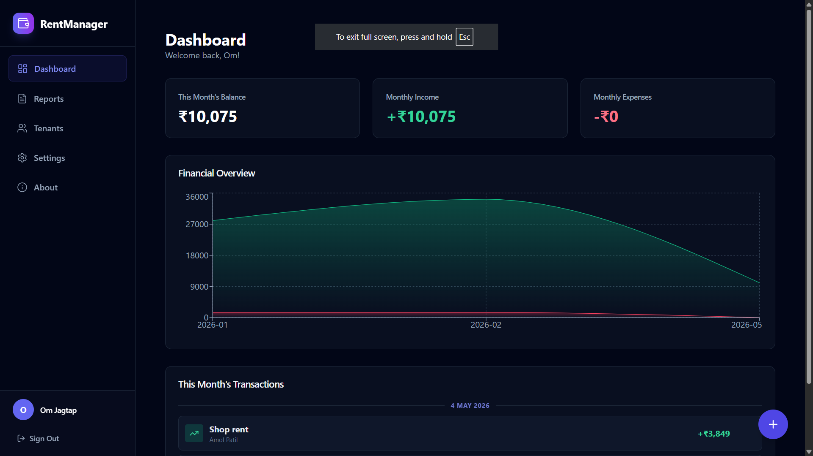
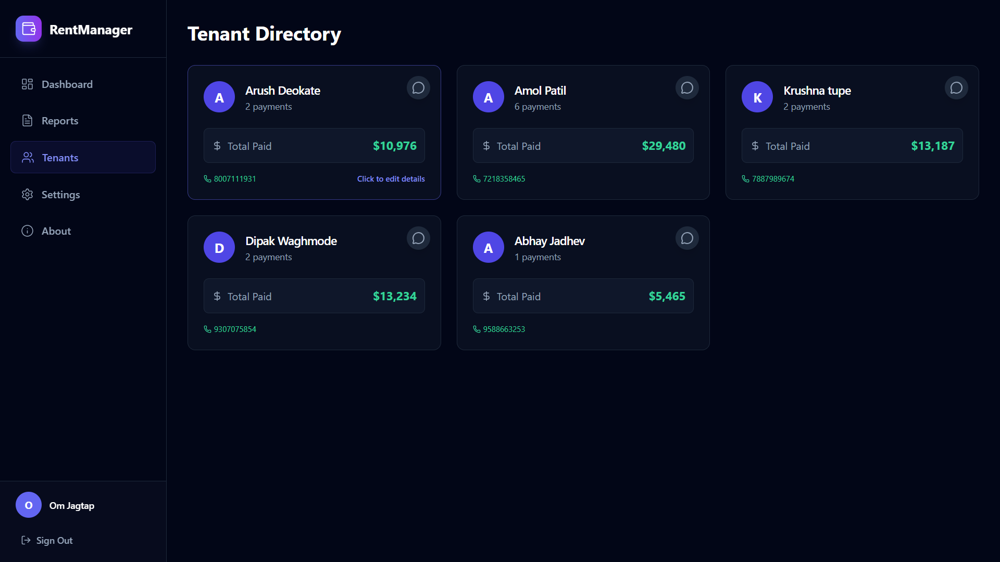
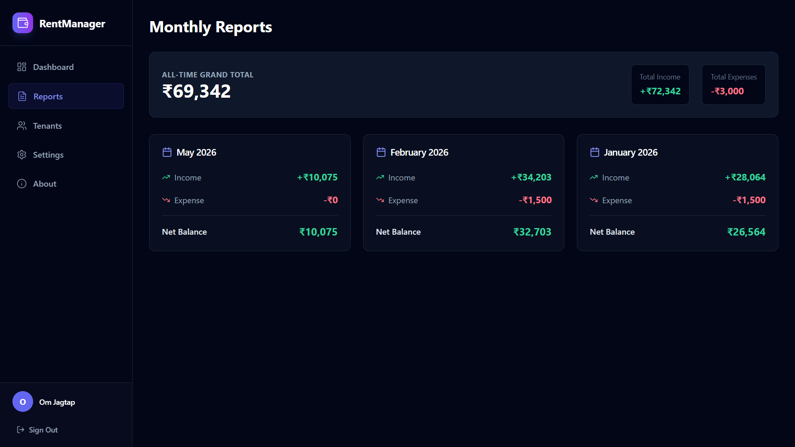

# Rently 🏠

[](https://github.com/OmJagtap07/Rently/actions/workflows/ci.yml)
[](https://app.netlify.com/sites/rentmanager0/deploys)
[](https://opensource.org/licenses/MIT)

A property management dashboard for landlords to track **rental income, expenses, and tenant rent collection** — all in one place.

> 🔜 **Coming soon:** Tenant portal with rent due notifications and payment history.

## 🚀 Live Demo
👉 **[rentmanager0.netlify.app](https://rentmanager0.netlify.app/dashboard)**

---

## ✨ Features

- **🔐 Secure Authentication:** Seamless Google Sign-In powered by Firebase Authentication.
- **🏡 Property Management:** Create and manage multiple properties, each with its own unique join code for easy tenant onboarding.
- **🧑‍🤝‍🧑 Role-Based Access:** Dedicated interfaces for Landlords (management) and Tenants (viewing dues and submitting requests).
- **📊 Interactive Dashboard:** Visual financial overview with dynamic charts (powered by Recharts).
- **💸 Expense & Income Tracking:** Easily log, categorize, and delete transactions. Grouped by date for easy reading.
- **👥 Tenant Management:** Keep track of tenants and associate incomes with specific tenants.
- **📈 Financial Reports:** Detailed insights into your monthly balances, total income, and total expenses.
- **📱 Fully Responsive:** Carefully crafted mobile-friendly design that works perfectly on all devices.
- **🌙 Modern Dark UI:** Sleek, dark theme built with Tailwind CSS.

### Tenant Portal (Coming Soon)
- 🔔 Rent due notifications
- 📬 Payment confirmation and history
- 💬 Owner-tenant communication

## 🛠 Tech Stack
| Layer | Technology |
|---|---|
| Framework | React 18 + Vite |
| Styling | Tailwind CSS |
| Database | Firebase Firestore |
| Auth | Firebase Authentication |
| Deployment | Netlify |

## 📸 Screenshots

### Dashboard


### Tenant Overview  


### Rent Collection


## 📁 Project Structure
```
src/
├── components/       # Reusable UI components (Buttons, Cards, etc.)
├── context/          # React Contexts (AuthContext, PropertyContext)
├── hooks/            # Custom React hooks (useAuth, useProperties)
├── lib/              # Utility functions and helpers
├── pages/            # Application pages
│   ├── About.jsx
│   ├── Dashboard.jsx
│   ├── Properties.jsx# Property management interface
│   ├── Reports.jsx
│   ├── Settings.jsx
│   └── Tenants.jsx
├── App.jsx           # Main application entry & role-based routing
├── LandlordApp.jsx   # Dedicated app view for Landlords
├── TenantApp.jsx     # Dedicated app view for Tenants
└── firebase.js       # Firebase initialization and configuration
```

## ⚡ Getting Started

```bash
git clone https://github.com/OmJagtap07/Rently
cd Rently
npm install
cp .env.example .env    # add your Firebase config
npm run dev
```

## 🔧 Environment Variables
Create a `.env` file at the root using `.env.example` as reference:
```
VITE_FIREBASE_API_KEY=
VITE_FIREBASE_AUTH_DOMAIN=
VITE_FIREBASE_PROJECT_ID=
VITE_FIREBASE_STORAGE_BUCKET=
VITE_FIREBASE_MESSAGING_SENDER_ID=
VITE_FIREBASE_APP_ID=
```

## 🗺️ Roadmap
- [x] Owner dashboard
- [x] Multi-property support  
- [x] Rent collection tracking
- [x] Income / expense logging
- [ ] Tenant portal
- [ ] Rent due notifications
- [ ] Payment history for tenants
- [ ] Export reports as PDF
